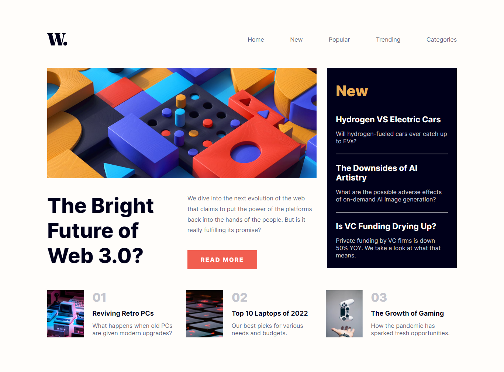
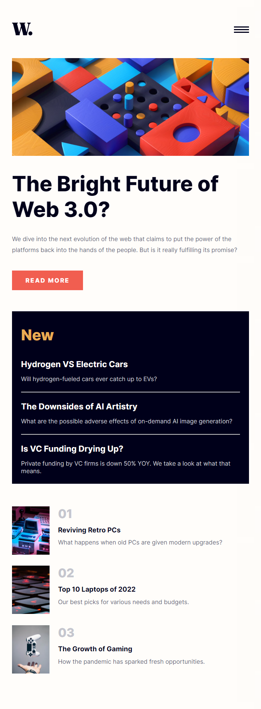
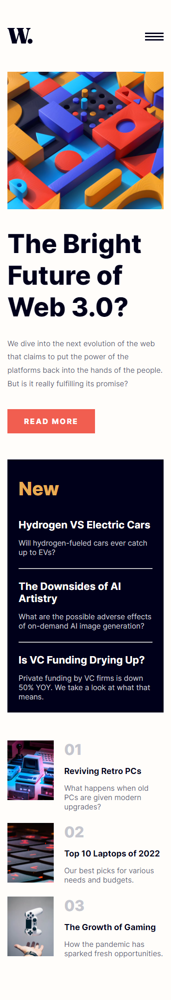

# News Home Page 

This is a solution to the [News Home Page challenge on Frontend Mentor]

### Links

- Solution URL: [https://github.com/SMarukona/news-home-page]
- Live Site URL: [https://smarukona.github.io/News-Home-Page/]

### Screenshot

### Built with

- Semantic HTML5 markup
- CSS custom properties
- Flexbox
-Vanilla Javascript

### What I learned
I refresh my knowledge about the flex box, hamberger menu with animation and many more

### Continued development
Need to focus more on time management

## Author
- Frontend Mentor - [@eewa-SANJ](https://www.frontendmentor.io/profile/eewa-SANJ)
- Github - [@SMarukona](https://github.com/SMarukona)
- Twitter - [@SMarukona](https://twitter.com/SMarukona)

